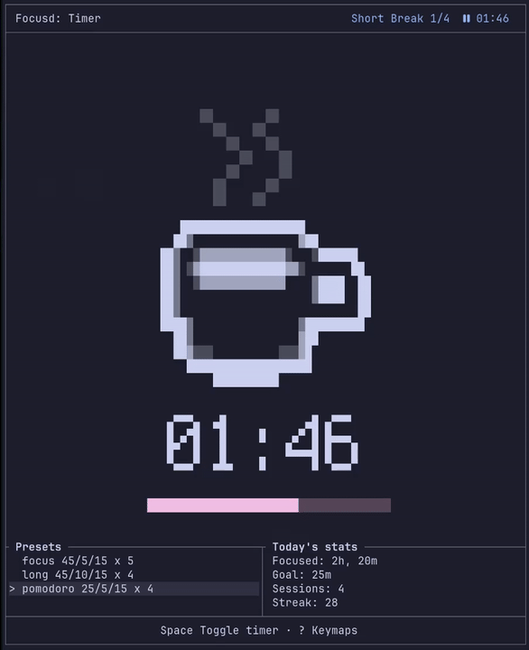
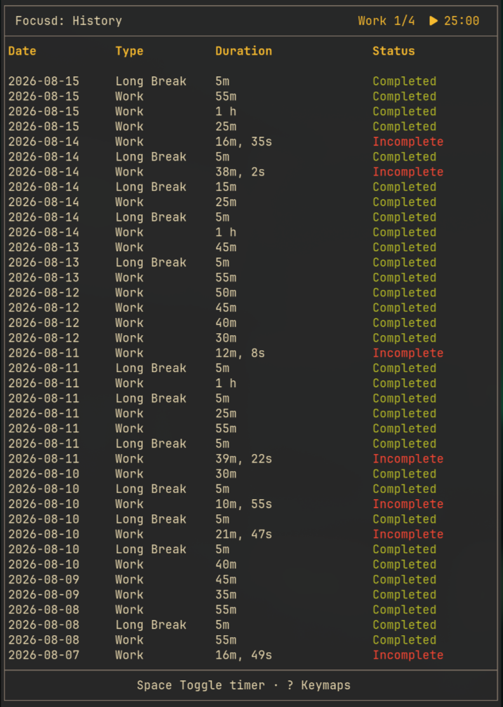
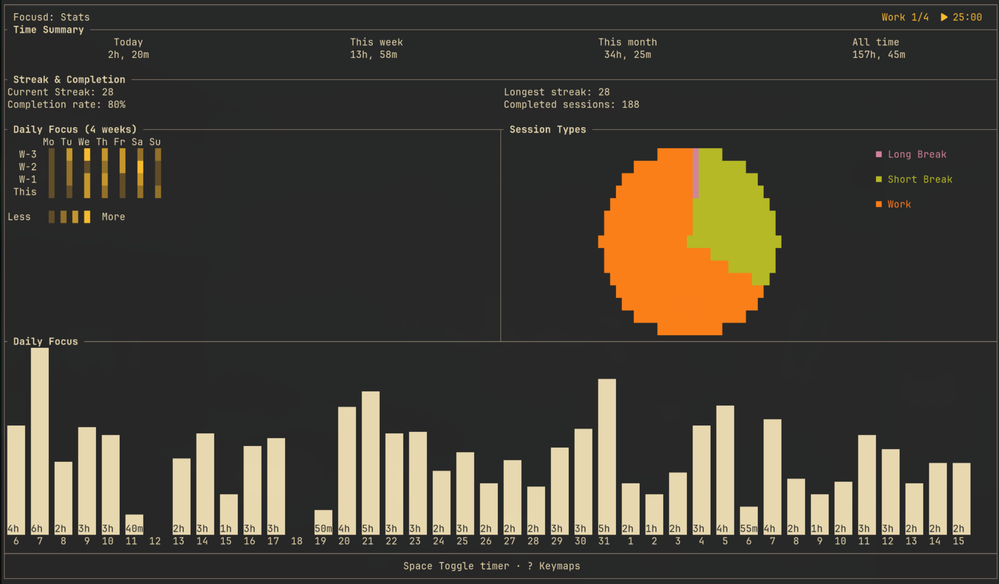
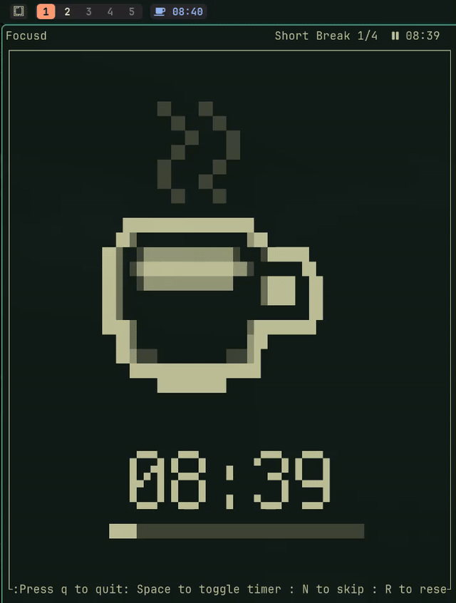
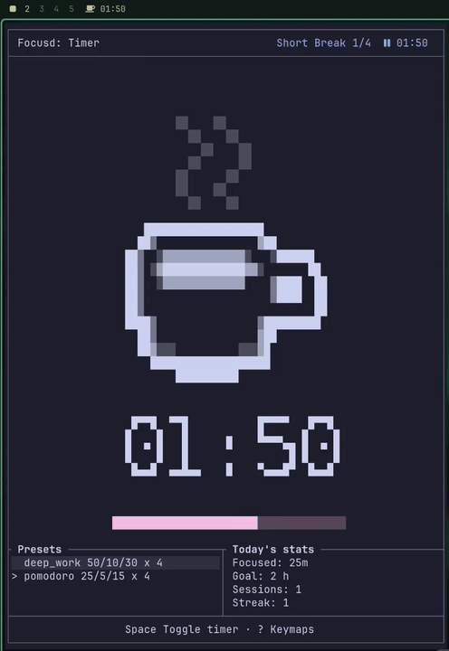

# FocusD

A beautiful terminal pomodoro timer with daemon, waybar integration and interactive TUI.



## Why Build Another Pomodoro Timer??

I know lots of pomodoro timer exists for terminal and for waybar. But none of them have all those features: waybar integration, nice TUI, history, statistics, streak. I decided to build my one to learn rust.

## Features

- Beautiful TUI with different themes.
- Lightning fast (written in rust)
- Long running daemon so it continues in background even if TUI is closed
- Configuration and custom presets
- Full history of all sessions
- Detailed statistics and streak to keep you motivated
- Custom focus categories with per-category daily hour goals
- Notification in timer completion
- Synced state between different TUIs.

## Screenshots

### Timer Page


### History Page



### Stats Page



### Waybar Integration



### Omarchy Plugin



See the [omarchy-focusd](https://github.com/BibekBhusal0/omarchy-focusd) for more info.

## Installation

### Mac-Os

```bash
brew tap bibekbhusal0/packages
brew trust bibekbhusal0/packages
brew install focusd
```

### Arch

```bash
yay -S focusd
```

### Windows

Not supported yet.

### Other

First make sure cargo is installed.

```bash
cargo install focusd
```

### Building from Source

```bash
git clone https://github.com/bibekbhusal0/focusd
cd focusd
cargo build --release
```

## Usage

After focusd is installed it can be launched with command `focusd`, which opens the TUI showing timer page. Pressing `Space` will start the timer.

### Commands

Those commands can also be seen by running `focusd --help`

- `stats` - Launch TUI in stats page.
- `history` - Launch TUI in history page.
- `settings` - Launch TUI in settings page.
- `pause` - Pause the timer if running.
- `toggle` - Toggle the timer.
- `reset` - Reset current session.
- `next`/`skip` - Skip to next session.
- `prints-stats` - Print stats.
- `print-history` - Print all the history.
- `status` - Shows timer status in JSON format, this is mainly for waybar (see the section for [waybar](#waybar-configuration))
- `category add <name> --goal-hours <hours>` - Create and select a category.
- `category select <name>` - Select the category for future work sessions.
- `category goal <name> <hours>` - Change a category's daily target.
- `category list` - Show today's progress for every category.
- `category remove <name>` - Remove a category without deleting its history.
- `--add-minutes` - Add minutes to the timer, but this will not go over the duration of the timer.
- `--start` - Start session, options: `work`, `short-break`, `long-break` or empty (it will restart current session if empty).
- `--preset` - Select specific preset.
- `--stop-daemon` - Stop daemon if running.
- `--daemon` - Start daemon (force stops currently running daemon).

### Keymap

For TUI those are the keymaps (You can see those keymaps by pressing `?` which shows help menu):

- `space` toggle pomodoro timer.
- `n` skip to next session.
- `r` reset current session.
- `q` to exit the TUI.
- `[` to go to next page.
- `]` to go to previous page.
- `j`/`k` to scroll in history page.
- `c` to switch to the next focus category.

### Categories and Daily Targets

Categories let one Pomodoro timer track separate areas such as study, programming, music, or exercise. A category's goal is measured per day; completed and partial work sessions both contribute their actual elapsed time.

```bash
# Create categories. Decimal hours are supported.
focusd category add Study --goal-hours 2
focusd category add Guitar --goal-hours 0.5

# Choose what the next work session should count toward.
focusd category select Study
focusd --start work

# Review today's progress.
focusd category list
```

The active category is displayed in the TUI header. Press `c` to cycle categories before starting a work session. Old history is migrated automatically and assigned to `General`.

### Shell Aliases

You can setup alias for bash/zsh like this to use it quickly.

```bash
alias pomo='focusd'

```

### Setting Hyprland Keybinds

If you are on hyprland keymap can be setup like this:

```lua
hl.bind("SUPER + P", hl.dsp.exec_cmd("focusd toggle"), {descriptatio = "Pomodoro toggle"})
hl.bind("SUPER + N", hl.dsp.exec_cmd("focusd next"), {descriptatio = "Pomodoro next"})
```

If old `.conf` file

```conf
bindd = SUPER, P, Pomodoro toggle, exec, focusd next
```

### Building Custom Menu with Walker

If you are using walker as launcher and menu, I recommend creating a picker menu to quickly execute different commands instead of setting different keybinds.

```bash
#!/usr/bin/env bash

choice=$(printf '%s\n' \
  ' Start' \
  ' Pause' \
  ' Work' \
  ' Short Break' \
  '󰒲 Long Break' \
  ' Resume' \
  ' Toggle' \
  ' Reset' \
  '󰒭 Next' \
  ' Stats' \
  ' History' \
  '󰧨 TUI' \
  ' Settings' \
  | walker --dmenu -p "focusd:")

case "$choice" in
  ' Start') focusd start ;;
  ' Pause') focusd pause ;;
  ' Work') focusd work ;;
  ' Short Break') focusd short-break ;;
  '󰒲 Long Break') focusd long-break ;;
  ' Resume') focusd resume ;;
  ' Toggle') focusd toggle ;;
  ' Reset') focusd reset ;;
  '󰒭 Next') focusd next ;;
  ' Stats') xdg-terminal-exec focusd stats ;;
  ' History') xdg-terminal-exec focusd history ;;
  '󰧨 TUI') xdg-terminal-exec focusd ;;
  ' Settings') xdg-terminal-exec focusd settings;;
esac
```

### Building Custom Menu with Omarchy

Similarly if you are in [omarchy](https://omarchy.org/) you can create menu like this.

Add these entries to `~/.config/omarchy/extensions/omarchy-menu.jsonc` (it hot-reloads on save):

```jsonc
"focusd": { "icon": "󱎫", "label": "FocusD" },
"focusd.start": { "icon": "", "label": "Start", "action": "focusd start" },
"focusd.pause": { "icon": "", "label": "Pause", "action": "focusd pause" },
"focusd.work": { "icon": "", "label": "Work", "action": "focusd work" },
"focusd.short-break": { "icon": "", "label": "Short Break", "action": "focusd short-break" },
"focusd.long-break": { "icon": "󰒲", "label": "Long Break", "action": "focusd long-break" },
"focusd.resume": { "icon": "", "label": "Resume", "action": "focusd resume" },
"focusd.toggle": { "icon": "", "label": "Toggle", "action": "focusd toggle" },
"focusd.reset": { "icon": "", "label": "Reset", "action": "focusd reset" },
"focusd.next": { "icon": "󰒭", "label": "Next", "action": "focusd next" },
"focusd.stats": { "icon": "", "label": "Stats", "action": "omarchy-launch-or-focus-tui \"focusd stats\"" },
"focusd.history": { "icon": "", "label": "History", "action": "omarchy-launch-or-focus-tui \"focusd history\"" },
"focusd.tui": { "icon": "󰧨", "label": "TUI", "action": "omarchy-launch-or-focus-tui \"focusd\"" },
"focusd.settings": { "icon": "", "label": "Settings", "action": "omarchy-launch-or-focus-tui \"focusd settings\"" },
```

Open the menu with `omarchy menu summon focusd` (or bind it to a keybind) to try it out.

### Omarchy Integration

If you use Omarchy 4, install the [FocusD bar plugin](https://github.com/BibekBhusal0/omarchy-focusd) to show the current session and remaining time right in the bar, with a control panel to pause, skip, or stop sessions:

```bash
omarchy plugin add https://github.com/BibekBhusal0/omarchy-focusd.git --enable
```

After installing, the widget appears on the right side of the bar. See the [plugin README](https://github.com/BibekBhusal0/omarchy-focusd) for usage and customization.

## Configuration

The config file is stored at `~/.config/focusd/config.toml`
This is the [default config file](./examples/config.toml).

### Hooks

Hooks allow you to run custom commands when a session starts, pauses, or resumes. This can be used to control music, block websites, or integrate Focusd with other tools.

These are all the available hooks:

```toml
# Generic hooks
hook_pause = ""
hook_resume = ""

# Work session hooks
hook_start_work = ""
hook_pause_work = ""
hook_resume_work = ""

# Short break hooks
hook_start_short_break = ""
hook_pause_short_break = ""
hook_resume_short_break = ""

# Long break hooks
hook_start_long_break = ""
hook_pause_long_break = ""
hook_resume_long_break = ""
```

Generic hooks run for every session. Session-specific hooks run only for that session type. When both are configured, the generic hook runs first, followed by the session-specific hook.

#### Playing and Pausing Music

On Linux, [playerctl](https://github.com/altdesktop/playerctl) can control media players that support MPRIS.

```toml
# Pause music when work starts and resume it when work is paused.
hook_start_work = "playerctl pause"
hook_pause_work = "playerctl play"

# Pause and resume music using the generic hooks.
hook_pause = "playerctl pause"
hook_resume = "playerctl play"
```

#### Website Blocking

Focusd does not implement website blocking itself. You can use hooks with an external blocker such as [FreeBlock](https://github.com/Mikuel210/FreeBlock), which supports Linux and macOS.

For example, if FreeBlock is configured to block your chosen websites:

```toml
# blocking/unblocking based on session
hook_start_work = "printf '\\n' | freeblock block @distractions"
hook_start_short_break = "freeblock unblock @distractions"
hook_resume_short_break = "freeblock unblock @distractions"

# unblock when paused
hook_pause_work = "freeblock unblock @distractions"
hook_resume_work = "printf '\\n' | freeblock block @distractions"
```

`@distractions` is a FreeBlock list. Create it with `freeblock list add distractions`, with one website per line and app process names prefixed by `+`. The piped newline accepts FreeBlock's default browser-closing confirmation when the hook runs without an interactive terminal.

### Waybar Configuration

The command `focusd status` gives output in JSON format which can be used for Waybar.

```json
{
  "text": "37:18",
  "alt": "work",
  "class": ["work"],
  "percentage": 25,
  "tooltip": "Work Session\nCycle 2/4\n\nNext: Short Break (10m)\n\nCompleted Today: 4\nFocused Today: 1h 38m\nCurrent Streak: 16 days"
}
```

Add a custom module in your Waybar:
change `~/.config/waybar/config.jsonc` to include pomodoro module.

```jsonc
"custom/pomodoro": {
  "return-type": "json",
  "exec": "focusd status",
  "interval": 1,
  "format": "{icon} {text}",
  "tooltip":true,
  "format-icons": {
    "work": "", // Other options , 🍅
    "work-paused": "󰏤", //  other options 󰏤 ,,, , or same as above and change opacity from styles.css
    "short-break": "", // other options ☕, 🍪, 🥤, 
    "short-break-paused": "󰏤",
    "long-break": "󰒲", // Other options 🏖️,⏳,🌴
    "long-break-paused": "󰏤"
  },

  "on-click": "focusd toggle",
  "on-click-right": "focusd next",
  "on-click-middle": "focusd reset",
},

...

"modules-right": [
  "custom/pomodoro"
]
```

or if you want icons based on progress:

```jsonc
"format-icons": [ "󰪞", "󰪟", "󰪠", "󰪡", "󰪢" ], // Make sure to give different colors to recognize session type/state
```

#### Styling

The module exposes state through CSS classes.

Example:

```css
#custom-pomodoro.work {
  color: #a6e3a1;
}

#custom-pomodoro.short-break {
  color: #89b4fa;
}

#custom-pomodoro.long-break {
  color: #cba6f7;
}

#custom-pomodoro.paused {
  opacity: 0.6;
}
```

## Roadmap

This project is far from perfect and I will keep improving this. Here are some of the planned features.

- [x] Include hooks (to be triggered when session ends/starts)
- [x] Including settings page so that settings can be changed interactively
- [x] Daily goals
- [ ] Play sounds when session ends
- [ ] Session tags

## Contributing

Feel free to open issues if you encounter any issues or have some feature ideas.

## License

This is licensed under MIT license. Check [License](LICENSE) for more details.
